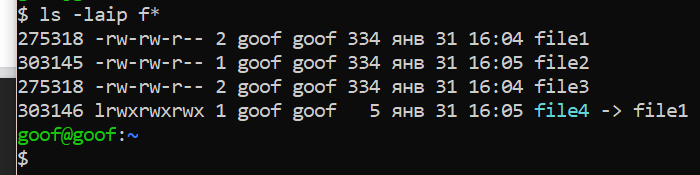
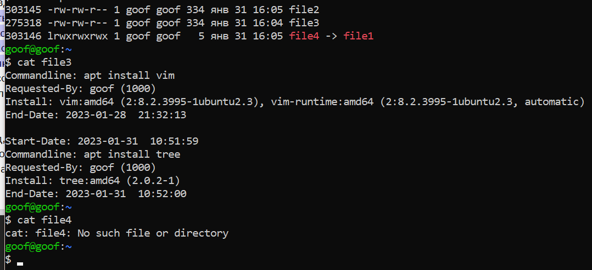
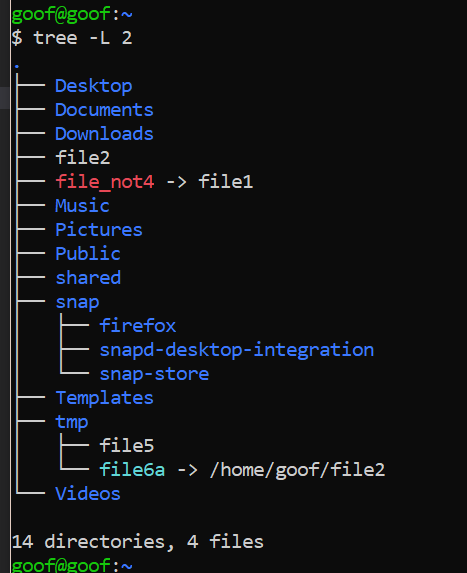

###	1.Используя команду cat, создать два файла с данными, а затем объединить их.
### Просмотреть содержимое созданного файла. Переименовать файл, дав ему новое имя.

<!-- ### hw2.1.sh -->
	cat > file1
	cat > file2
	cat file1 file2 > file3
	cat file3
	mv file3 file2+file1
___

###	2.Создать несколько файлов. Создать директорию, переместить файл туда.
### Удалить все созданные в этом и предыдущем задании директории и файлы.

<!-- ### hw2.2.sh -->
	touch fil{1..9}
	mkdir dir
	mv fil* dir
	rm fil*
	rm -r dir
___

###	3.Создать файл file1 и наполнить его произвольным содержимым.
### Скопировать его в file2. Создать символическую ссылку file3 на file1.
### Создать жесткую ссылку file4 на file1. Посмотреть, какие айноды у файлов. Удалить file1.
## Что стало с остальными созданными файлами? Попробовать вывести их на экран.

<!-- ### hw2.3.sh -->
	tail /var/log/apt/history.log | cat > file1
	cp file1 file2
	ln file1 file3
	ln -s file1 file4
	ls -laip f*
	rm file1
	cat file3
	cat file4

#### Посмотреть айноды !

	file3 выводится нормально, содержимое без изменений
	file4 файл для вывода отсутствует, о чем в терминале и написано

#### Попытка вывода, ну и заодно виден листинг директории !

___

###	4. Дать созданным файлам другие, произвольные имена.
### Создать новую символическую ссылку.
### Переместить ссылки в другую директорию.

<!-- ## hw2.4.sh -->
	mv file3 file5
	mv file4 file_not4
	ln -s /home/goof/file2 file6a
	mkdir tmp
	mv file_not4 file6a tmp

___
