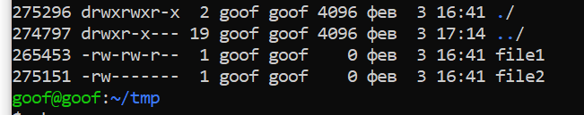
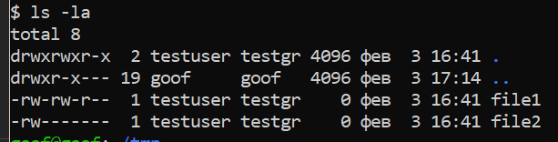
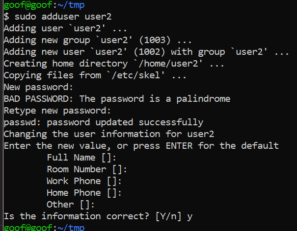
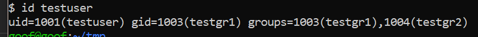

###	1.  Создать два произвольных файла.
###     Первому присвоить права на чтение и запись для владельца и группы, только на чтение — для всех.
###     Второму присвоить права на чтение и запись только для владельца.
###     Сделать это в численном и символьном виде.

<!-- ### hw3.1.sh -->
	touch file1 file2
### file1 ->> **664** or **u=rw,g=rw,o=r**
    sudo chmod u=rw,g=rw,o=r file1

    sudo chmod 664 file1
<!-- or -->

### file2 ->> **600** or **u=rw,g=,o=**
    sudo chmod u=rw,g=,o= file2
	sudo chmod 600 file2

___

###	2.  Назначить новых владельца и группу для директории целиком.
<!-- ### hw3.2.sh -->
_    
#### для перестраховки создадим еще юзверя и группу
    sudo useradd -s /bin/bash -m testuser
    sudo groupadd testgr

	sudo chown testuser:testgr . -R

___

### 3.   Управление пользователями:
* создать пользователя, используя утилиту useradd и adduser;
* удалить пользователя, используя утилиту userdel.
<!-- ### hw3.3.sh -->
	sudo useradd -m user1
    sudo userdel -r user1

    sudo adduser user2
    sudo userdel -r user2
#### даже без шелл -- все равно удалять )

___

### 4.  Управление группами:
* создать группу с использованием утилит groupadd и addgroup;
* попрактиковаться в смене групп у пользователей;
* добавить пользователя в группу, не меняя основной

<!-- ## hw3.4.sh -->
	sudo groupadd testgr1
    sudo addgroup testgr2

    sudo usermod -g testgr2 testuser
    sudo usermod -g testgr1 testuser
    sudo usermod -g testuser testuser
    sudo usermod -aG testgr2 testuser

    sudo gpasswd -d testuser testgr2
    sudo groupdel testgr2
    sudo groupdel testgr1
	

___

### 5.  Создать пользователя с правами суперпользователя. Сделать так, чтобы sudo не требовал пароль для выполнения команд.
    sudo visudo

    testuser    ALL = NOPASSWD:ALL

___

### 6.  Используя дополнительные материалы, выдать одному из созданных пользователей право на выполнение ряда команд, требующих прав суперпользователя (команды выбираем на своё усмотрение).
    sudo visudo
    testuser    ALL = NOPASSWD: /usr/bin/apt, /usr/bin/chmod
___
### 7.  Создать группу developer и нескольких пользователей, входящих в неё. Создать директорию для совместной работы. Сделать так, чтобы созданные одними пользователями файлы могли изменять другие пользователи этой группы.
    sudo groupadd developers
    sudo useradd -s /bin/bash -m user1
    sudo useradd -s /bin/bash -m user2
    sudo useradd -s /bin/bash -m user3
    sudo usermod -aG developers user1
    sudo usermod -aG developers user2
    sudo usermod -aG developers user3

    sudo mkdir /home/working4all
    sudo chgrp -R developers /home/working4all

    sudo chmod g+s /home/working4all
___
### 8.   Создать в директории для совместной работы поддиректорию для обмена файлами, но чтобы удалять файлы могли только их создатели.
    sudo mkdir folder4share
    sudo chmod +t folder4share

    sudo chmod g+w folder4share
___
### 9.  Создать директорию, в которой есть несколько файлов. Сделать так, чтобы открыть файлы можно было, только зная имя файла, а через ls список файлов посмотреть было нельзя.
    cd ~
    mkdir directory
    sudo chmod -r directory
___
