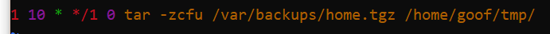

###	1.  Подключить дополнительный репозиторий на выбор: Docker, Nginx, Oracle MySQL. Установить любой пакет из этого репозитория.

### Выбран http://nginx.org/ru/linux_packages.html 

> Установите пакеты, необходимые для подключения apt-репозитория:\
    ```sudo apt install curl gnupg2 ca-certificates lsb-release ubuntu-keyring```\
\
Теперь нужно импортировать официальный ключ, используемый apt для проверки подлинности пакетов. Скачайте ключ:\
    ```curl https://nginx.org/keys/nginx_signing.key | gpg --dearmor \
        | sudo tee /usr/share/keyrings/nginx-archive-keyring.gpg >/dev/null```\

> Проверьте, верный ли ключ был загружен:\
    ```gpg --dry-run --quiet --no-keyring --import --import-options import-show /usr/share/keyrings/nginx-archive-keyring.gpg```\
\
Вывод команды должен содержать полный отпечаток ключа ```573BFD6B3D8FBC641079A6ABABF5BD827BD9BF62``` :

\

> Если отпечаток отличается от вышеуказанного, удалите файл ключа.
\
Для подключения apt-репозитория для стабильной версии nginx, выполните следующую команду:\
    ```echo "deb [signed-by=/usr/share/keyrings/nginx-archive-keyring.gpg] \
    http://nginx.org/packages/ubuntu `lsb_release -cs` nginx" \
        | sudo tee /etc/apt/sources.list.d/nginx.list```

> Если предпочтительно использовать пакеты для основной версии nginx, выполните следующую команду вместо предыдущей:\
    ```echo "deb [signed-by=/usr/share/keyrings/nginx-archive-keyring.gpg] \
    http://nginx.org/packages/mainline/ubuntu `lsb_release -cs` nginx" \
        | sudo tee /etc/apt/sources.list.d/nginx.list```

> Для использования пакетов из нашего репозитория вместо распространяемых в дистрибутиве, настройте закрепление:\
    ```echo -e "Package: *\nPin: origin nginx.org\nPin: release o=nginx\nPin-Priority: 900\n" \
        | sudo tee /etc/apt/preferences.d/99nginx```\

> Чтобы установить nginx, выполните следующие команды:\
    ```sudo apt update
    sudo apt install nginx```
___

###	2.  Установить и удалить deb-пакет с помощью dpkg.

#### для начала скачаем пакет некий пакет )
    wget http://archive.ubuntu.com/ubuntu/pool/universe/d/dosbox/dosbox_0.74-3-4_amd64.deb

#### Инсталлируем
	sudo dpkg -i dosbox_0.74-3-4_amd64.deb
#### Деинсталлируем
    sudo dpkg -r dosbox
___

### 3   Установить и удалить snap-пакет.

#### Инсталлируем
    sudo snap install gedit
#### Деинсталлируем
    sudo snap remove gedit
___

! ### 4.  Добавить задачу для выполнения каждые 3 минуты (создание директории, запись в файл). 

	crontab -e
	

### Удаляем задачи
    crontab -r
___

### 5.  Подключить PPA-репозиторий на выбор. Установить из него пакет. Удалить PPA из системы.
    sudo add-apt-repository ppa:notepadqq-team/notepadqq

    sudo apt update

    sudo apt install notepadqq

    sudo add-apt-repository -r ppa:notepadqq-team/notepadqq

___

### 6.  Создать задачу резервного копирования (tar) домашнего каталога пользователя. Реализовать с использованием пользовательских crontab-файлов.

#### Ну root тоже проде как пользователь ))
    sudo crontab -e



___
