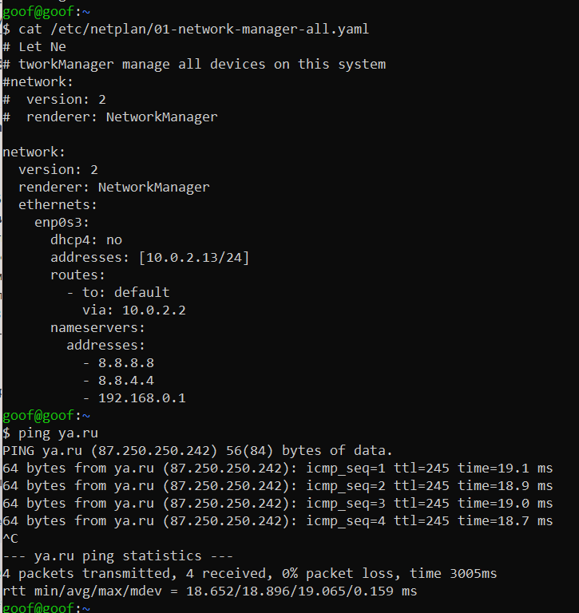

### 1.  Настроить статическую конфигурацию (без DHCP) в Ubuntu через ip и netplan. Настроить IP, маршрут по умолчанию и DNS-сервера (1.1.1.1 и 8.8.8.8). Проверить работоспособность сети.
    sudo vim /etc/netplan/01-network-manager-all.yaml

#### ну, это в моем случае, виртуалка за натом
#### хотя возможно 192.и.т.д. не надо ))
___
###	2.  Настроить правила iptables для доступности сервисов на TCP-портах 22, 80 и 443.
###     Также сервер должен иметь возможность устанавливать подключения к серверу обновлений. Остальные подключения запретить.

    sudo iptables -A INPUT -m state --state RELATED,ESTABLISHED -j ACCEPT
    sudo iptables -A INPUT -p tcp -m tcp --dport 22 -j ACCEPT
    sudo iptables -A INPUT -p tcp -m tcp --dport 80 -j ACCEPT
    sudo iptables -A INPUT -p tcp -m tcp --dport 443 -j ACCEPT
    sudo iptables -A INPUT -i lo -j ACCEPT

    sudo iptables -P INPUT DROP

<!-- iptables -A INPUT -p tcp -m tcp --dport 8080 -j ACCEPT
    iptables -A INPUT -p icmp -j ACCEPT -->
___

###	3.  Запретить любой входящий трафик с IP 3.4.5.6.

    sudo iptables -A INPUT -s 3.4.5.6 -j DROP
#### ну или REJECT вместо DROP
___

### 4.   Запросы на порт 8090 перенаправлять на порт 80 (на этом же сервере).
    sudo iptables -t nat -I PREROUTING -p tcp --dport 8090 -j REDIRECT --to-port 80
___

### 5.  Разрешить подключение по SSH только из сети 192.168.0.0/24.
<!-- #### ну или в моем случае перенастроим на адрес 10.0.2.13 -->
    sudo iptables -L -nv
#### у нас вроде как настроен пропус 22 порта с любого адреса, поэтомы сначала удаляем правило
    sudo iptables -D INPUT -p tcp -m tcp --dport 22 -j ACCEPT
	sudo iptables -D INPUT -p tcp -m tcp -s 192.168.0.0/24 --dport 22 -j ACCEPT
<!-- sudo iptables -D INPUT -p tcp -m tcp -s 10.0.2.13 --dport 22 -j ACCEPT -->
___
