### 1.  Установить Nginx и настроить его на работу с PHP-FPM.
    sudo apt install nginx
    sudo apt install php8.1-fpm

    cat /etc/php/8.1/fpm/pool.d/www.conf | grep "listen ="
#### для понимания на каком сокете php-fpm слушает ))
#### и вносим изменения в конфиг "сайта"
    sudo vim /etc/nginx/sites-enabled/default

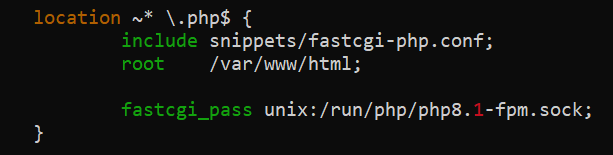
___
###	2.  Установить Apache. Настроить обработку PHP. Добиться одновременной работы с Nginx.

    sudo apt install apache2
    sudo apt install libapache2-mod-php8.1
#### надо апачУ порт поменять, бо пока-что они с енждиникс на одном и апач не запустится
    sudo sudo vim /etc/apache2/ports.conf
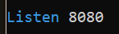

    sudo apache2ctl -t
    sudo systemctl reload apache2
___

###	3.  Настроить схему обратного прокси для Nginx (динамика - на Apache).
    sudo vim /etc/nginx/sites-enabled/default
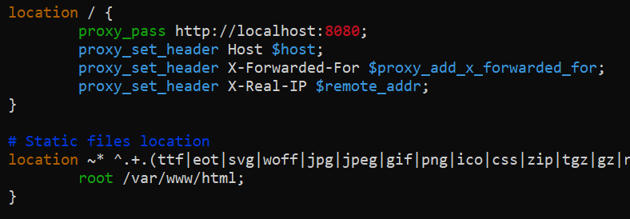
___

### 4.   Установить MySQL. Создать новую базу данных и таблицу в ней.
    sudo apt install mysql-server-8.0

    sudo mysql
####
    CREATE DATABASE mydata;
    CREATE TABLE test(i INT);
    INSERT INTO test (i) VALUES (1),(2),(3),(4);
    SELECT * FROM test;
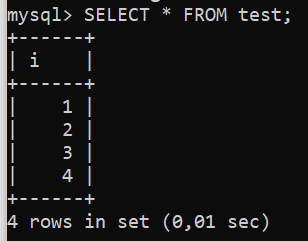
___

### 5.  Установить пакет phpmyadmin и запустить его веб-интерфейс для управления MySQL.

> Использовалась инструкция https://www.digitalocean.com/community/tutorials/how-to-install-and-secure-phpmyadmin-on-ubuntu-20-04-ru

#### Опытные товарищи советуют сразу несколько нужных пакетов добавить ))
    sudo apt install phpmyadmin php-mbstring php-zip php-gd php-json php-curl

### В выборе сервера поставить галку apache2 - [x]
    sudo phpenmod mbstring
    sudo systemctl restart apache2
### вместо ПАРОЛЬ поставить нужный пароль )
    CREATE USER 'sammy'@'localhost' IDENTIFIED WITH caching_sha2_password BY 'ПАРОЛЬ';

    GRANT ALL PRIVILEGES ON *.* TO 'sammy'@'localhost' WITH GRANT OPTION;
### Ну и для безопасности советуют
    sudo nano /etc/apache2/conf-available/phpmyadmin.conf
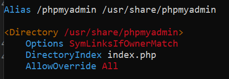

    sudo nano /usr/share/phpmyadmin/.htaccess
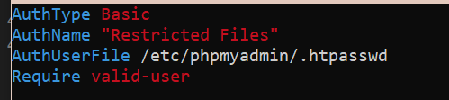

    sudo systemctl restart apache2
    sudo htpasswd -c /etc/phpmyadmin/.htpasswd sammy
### Итог наших мытарств:
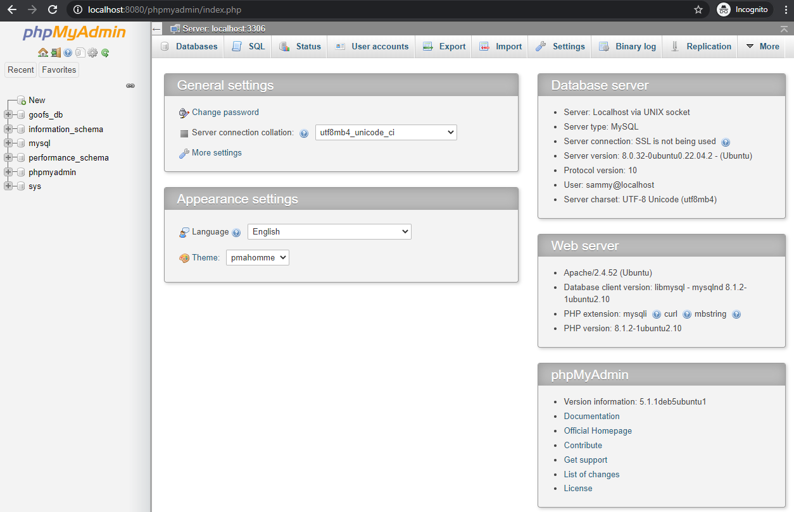
___
### 6.  Настроить схему балансировки трафика между несколькими серверами Apache на стороне Nginx с помощью модуля ngx_http_upstream_module.
### Заведем для начала еще один апач
    sudo vim ports.conf
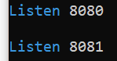

    sudo vim sites-enabled/000-default.conf
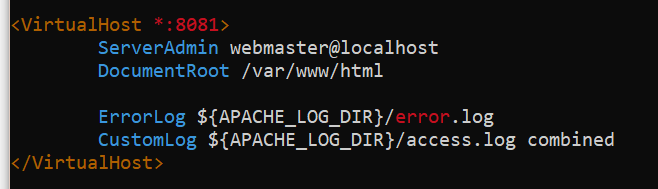

    sudo apache2ctl -t
    sudo systemctl reload apache2

### Теперь собственно "балансировка" в nginx
    sudo vim /etc/nginx/nginx.conf
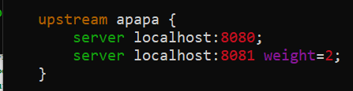

    sudo vim /etc/nginx/sites-enabled/default
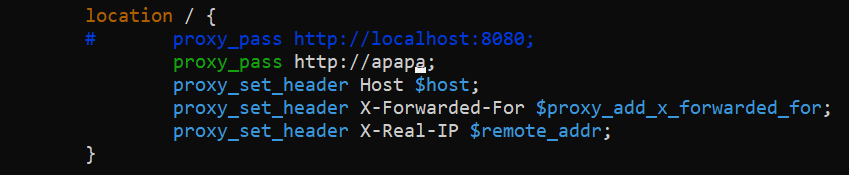

    sudo nginx -t
    sudo systemctl reload nginx
