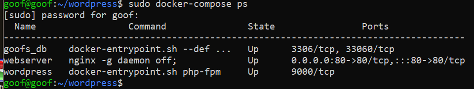
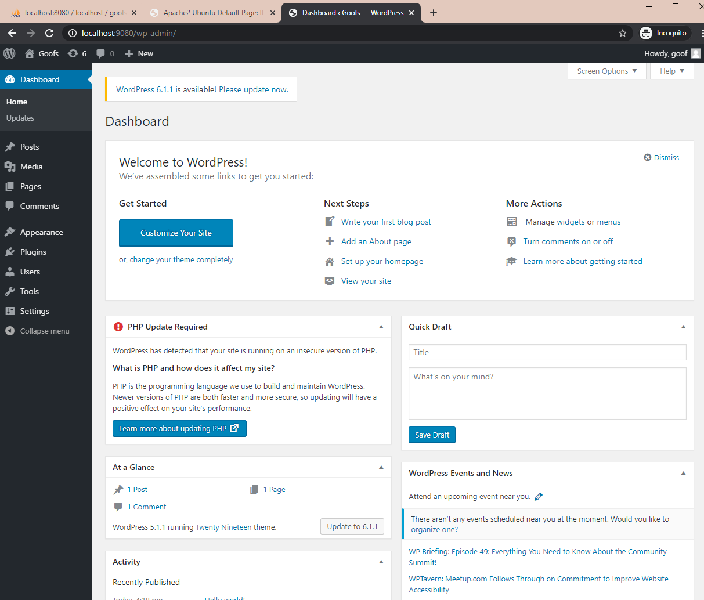
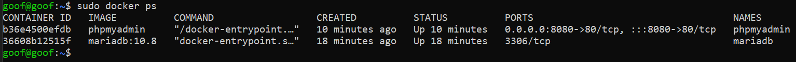
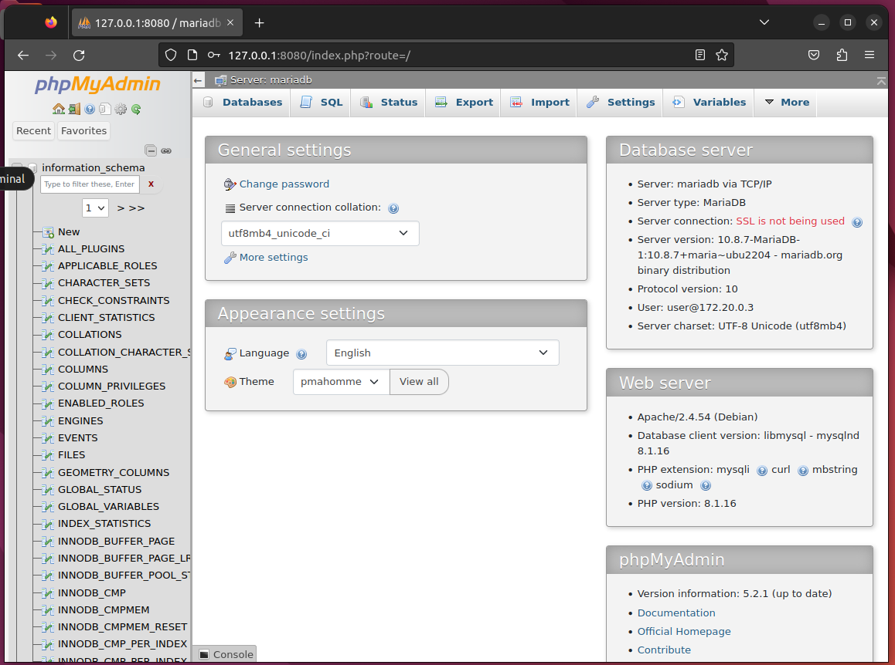

### 1.  Установить в виртуальную машину или VDS Docker, настроить набор контейнеров через docker compose по инструкции по ссылке: https://www.digitalocean.com/community/tutorials/how-to-install-wordpress-with-docker-compose-ru
### Часть с настройкой certbot и HTTPS опустить, если у вас нет настоящего домена и белого IP.

    mkdir wordpress
    cd wordpress
    mkdir nginx-conf
## Все как в туториале:
    nano nginx-conf/nginx.conf

<!--  -->

## Прописать своих пользователя и пароль:
    nano .env
<!--  -->

## Поменял только название баз под свои:
### ну и вырезал sert
    nano docker-compose.yml
<!--  -->
### Думал навставлять много картинок, но там действительно миниальные изменения в файлах
    sudo docker-compose up -d
    sudo docker-composer ps

### Итог:

___
___

###	2.  Запустить два контейнера, связанные одной сетью (используя документацию). Первый контейнер БД (например, образ mariadb:10.8), второй контейнер — phpmyadmin. Получить доступ к БД в первом контейнере через второй контейнер (веб-интерфейс phpmyadmin).
    docker network create -d bridge hw7-bridge-network

    docker create --name mariadb -e "MARIADB_USER=user" -e "MARIADB_PASSWORD=password" -e "MARIADB_ROOT_PASSWORD=rootp" --network hw7-bridge-network  mariadb:10.8

    docker start mariadb

    docker create --name phpmyadmin -e "PMA_ARBITRARY=1" -p 8080:80 --network hw7-bridge-network phpmyadmin

    docker start phpmyadmin
    
    docker ps

### Несмотря на то что где-то что-то запущено и даже кто-то кого-то видит, осталось ощущение что что-то я делаю не так %)

___
